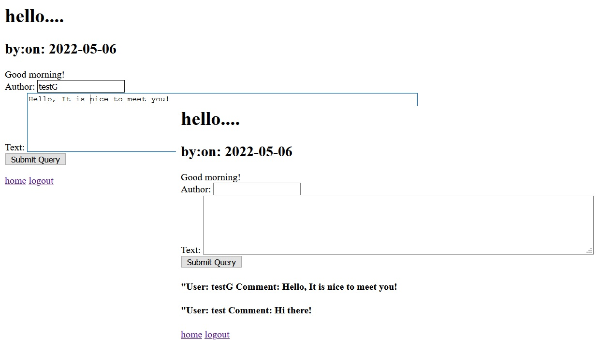

# Design and Impliment a Simple Minifacebook Application

## INTRODUCTION

### Overview of the Project Design

In this project we implemented a very simple facebook application. Anyone can register for an account in this simple **miniFacebook** web application. And the registered users(who are not disabled) can login to the system by creating a username and a password, change password, add a new post, edit their own posts, and add comments on any post.
Superusers does not need registration. They can login to the system, can view the list of registered users, can disable, or enable a registered user. Other than that, in this **miniFacebook** web application, the logged-in users can have real-time chat with others.
During the implementation our focus was to develop a defensive and robust program. We paid our attention to implement most of the security principles and practices what we learned during the SecAD course for our application. We applied security aspects in defense-in-depth and defense-in-breath. The **miniFacebook** web application was deployed on HTTPS which encrypts all traffic to the server. We validated all the user input/output, and it is defending the application by avoiding malicious code gets into the application. 

### Project Development

We followed all instructions given by the professor and developed our project step by step. 
First, we created SSL keys for our team repository and configured HTTPS in Apache2 with the new generated keys. So, we ensured it as all data transmission of our application is encrypted. 

  

Figure 1: HTTPS data transactions

We used both HTML, and PHP for developing out web application. The users need to login into the system. So as the starting step we developed a simple login form, user database and an index file for building the connection between the database and login data from users. Then we added a user registration form to the system. Users need to register by using a valid unique username, email, and a password. The user must confirm the password by retyping it. It is required to add first and last name of users and date of birth for registration. However, we kept adding the phone number and gender as a choice of the user.  
After successfully registering to the system users can change their password at any time when they need it. When users done their activities inside, they system they can successfully logout from the system. It means their session is finished. If they need to enter the system again, they need to provide their active username and the password to the system. 
An authenticated user can add new posts to the system. Also, they can add and view comments for any posts. The owner of a post or a comment can edit or delete their comment or the post. However, they cannot edit or delete others posts or comments. 
We added access control to the application and the database of the system. There are 2 types of user roles in our system, i.e., users and superusers. Superusers have the administrative properties. They have separate session authentication for their role. 

## DATABASE DESIGN

### Database:

In this project our main approach for database design was to take an understanding of developing a basic web application with PHP and mySQL and optimize the database design.

### Database Functionality:

Add/Get user information

Enable/Disable Users

Add/Edit/Delete Posts

Add Comments

Keep Admin Credentials 

The ‘superusers’ table has no connection between other tables. The records of system superusers and regular users are maintaining in two different tables. Superusers have administrative powers and only they have the authority to view the current list of all registered users. 
When a new user created an account the user credentials are storing in the ‘users’ table. All the details of posts which are coming from authenticated users are storing in ‘posts’ table. And all the details for comments are storing in comments tables.  
Any user can add posts as many as he wants. And any user can add any number of comments for any of the posts. Therefore, the other tables except the ‘superusers’ table are connecting each other by using the foreign keys. Since the ‘username’ is unique to the user, we used ‘username’ as the foreign key to maintain the integrity between users, posts, and comments tables. A post can have many comments. Therefore, we added ‘post_id’ as a foreign key of the comment table to maintain the connection between ‘comments’ table and ‘posts’ tables.

### Database Configuration:

The database schema contains 4 tables. i.e., users, superusers, posts, and comments

users - username(PrimaryKey), email, password,  fname, lname, phonenumber, DOB, gender, date_joined

superusers - username(PrimaryKey), password.

posts - post_id(PrimaryKey), post_msg, username( ForeignKey), date_posted  

comments - comment_id(PrimaryKey), post_id(ForeignKey), comment_msg, username(ForeignKey), date_posted  

  

Figure 2: database schema

### Database Security:

In general, the minifacebook is a social media application. So, it is gathering and keeping users’ data inside a database. Any person  who is connecting with social media application is happy to get the security of their data. So, as developers we need to protect trust of its users by firmly handle their data. 
In our application we added security measures to our database. Such as access authorization, access controls, data integrity and encryption of sensitive data(password hashed).

## USER INTERFACE

Since our application is a very basic and the main purpose of developing it is leaning to develop a secure application in cyber space, we did not give our priority for a fancy website development. The user interface is only with basic html codes used for displaying the outputs. We tried to use simple CSS coding for making our webpage user friendly and attractive. 

  

Figure 3: Web Interface and CSS – login and registration forms

## FUNCTIONALITY OF THE APPLICATION

In our application we have two different user roles, Users and Superusers. We maintain two different tables to store data of these two different user roles.
Anyone can register for an account and registered users(if the account is not disabled) can Login, change password,  add a new post, edit, or delete their own posts or add comments on any post
Superusers can credentials are stored directly in the database. They do not need to register for login to the system. They can disable (not delete) registered users when there is a requirement for it. And they can  enable a registered users as needed. 

## IMPLEMENTATION & SECURITY ANALYSIS

We applied Security principles almost each step of the development process. We deployed our application on HTTPS to make sure all transaction data are encrypted and protected. However, HTTPS cannot prevent application vulnerabilities like Cross-site scripting attacks(XSS), SQL Injection Attacks(SQLi), Session Hijacking. Therefore, in our application we sanitize the HTML outputs for preventing the Cross-site scripting (XSS) attacks. As same as we are validating all HTML, PHP, and SQL inputs in every layer of our application. For taking care of  our databases security, we are not using MySQL root account data within our PHP code. All the user passwords are hashing before they are storing in our database. To protect our database, we implemented prepared statements as a prevention measure for SQL Injection(SQLi) attacks. Prepared statements map SQL query given by the user to hard coded query format and it can act as a barrier for entering malicious inputs to the database.
We applied defense in depth security strategies for preventing Session Hijacking Attacks. We implemented a session auth code with session cookie parameters for our application. We controlled the database access. So, the users do not allow to access to data of other users. We created two different user roles with different permissions on actions. Superusers role has a different session variable, and it has the admin privileges, but regular users do not have that permission. 
We took necessary actions for preventing from Cross Site Request Forgery (CSRF) Attacks. When an authorized user is changing his own password, a secret random token is generating and store it in the session. And the system required this code for changing the password for a user. So, attackers cannot find or see this secret code for entering the system and changing data of authorized users. 
We implemented Input validation security functionality in our applications So, all the data from all potentially untrusted sources subject to input validation.

## DEMO(SCREENSHOTS)

Figure 4: Anyone can register a new account and after creating an account they can login to the system by using a valid username and a password.

  

Figure 5: A user can create an account and a registered users can login to the system

Figure 6: A logged in user can change his password successfully. Because of username is belonging to the session he cannot change any other passwords. 

  

Figure 7: A logged in user can create post, edit his posts, or delete his posts. But he cannot edit or delete other users’ posts. This screen capture is showing that edit and delete buttons of a post only visible to the owner of the post. 

 

Figure 8: Any logged in user can view and add comments to any of posts.

 

Figure 9: Superusers credentials are directly stored in the database. They don’t need to register. They can login to the system with a valid username and a password.

 

Figure 10: Superusers can activate and deactivate any user account. After deactivating an account, he/she cannot login to the system.

 

## ACHIVEMENTS

Even though web interface of our minifacebook application is not attractive, we achieved all the main requirements which are expected from this project. However, we did not get enough time to implement the chat integration. Our application is achieving all the required security measures. So, we can say it as we are successful in our minifacebook application development. We will design the web interface to our minifacebook application in near future. 

**This is a team project, we did as the final project for our Secure Application Development Class. I will share the all credits with my teammate 
[Joshua Cowden](https://www.linkedin.com/in/joshua-cowden-59957819b/)
.**
